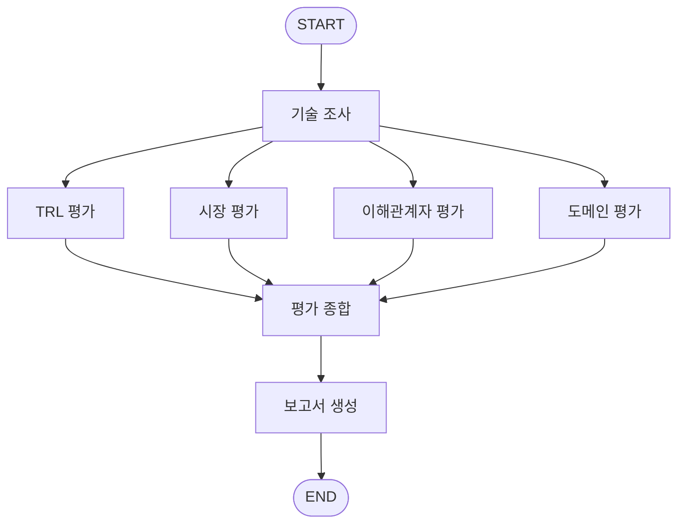

# Subject

본 프로젝트는 KV cache 최적화 기술을 소프트웨어, 하드웨어 두 진영에서 선정하여,
시장·이해관계자·도메인 관점에서 평가하는 Agentic RAG를 개발하는 프로젝트 임.

LLM은 토큰을 하나씩 생성하면서 앞서 계산한 Key-Value를 저장해 재사용한다. 이 KV cache는
재계산 낭비를 없애주지만, 문맥이 길어질수록 선형으로 누적되어 가속기의 HBM 용량을 빠르게 소진한다.
**KV cache는 "연산 병목"을 "메모리 병목"으로 바꿔 놓은 셈이다.**

이 병목을 푸는 접근은 두 갈래로 갈린다. **데이터를 작게 만드는 SW 진영**과
**담을 공간을 넓히는 HW 진영**이다. 본 프로젝트는 각 진영에서 한 건씩 선정해,
**어느 쪽이 우수한지 판정하지 않고** 관점에 따라 평가가 어떻게 달라지는지를 비교한다.

## Overview

- **Objective** : 하나의 기술을 복수 관점에서 비교 평가 — 우열 판정이 아니라 **관점별 인식 차이**를 규명
- **Method** : Multi-Agent(Distributed) + Agentic RAG
- **Domain** : 데이터센터 / 클라우드 대규모 서빙
- **Tools** : PDF RAG Retriever(FAISS + bge-m3), Tavily Web Search, LLM Structured Output

평가 관점은 네 가지다. **기술 성숙도(TRL)** 는 절대 척도로 현재 위치를 재고,
**시장성**은 시장이 이 기술의 가치를 어떻게 인식하는지, **이해관계자**는 경쟁사·도입 기업·투자 업계가
어떻게 반응하는지, **도메인 적용성**은 데이터센터 환경에서 실제로 쓸 만한지를 각각 묻는다.
네 관점은 병렬로 수행되고, 종합 단계에서 **상충 지점이 드러나도록** 합쳐진다.

## Selected Technologies

- **SW : DeepSeek-V2 (MLA)**
  사후 압축이 아니라 **어텐션 구조 단계에서 KV cache 발생량 자체를 줄이는** 접근이다.
  여러 head의 K/V를 공통 저차원 latent로 joint compression하며, up-projection을 query 쪽으로 흡수해
  **복원 없이 latent 그대로 연산**한다. MHA 대비 KV cache 93.3% 감소를 보고한다.
  구조 혁신이 있는 만큼 시스템 적용성·도입 복잡성 등 평가할 관점이 많다고 판단했다.

- **HW : ITME (CXL-Hybrid Tiered Memory Expansion)**
  데이터를 줄이지 않고 **담을 곳만 바꾸는** HW 확장의 원형이다.
  NAND SSD를 바이트 주소 지정이 가능한 원격 메모리로 노출해 TB급 KV cache 계층을 신설한다.
  HW 확장의 대가(DRAM 캐시를 2배로 키우면 온칩 SRAM이 86.7% 폭증)를 논문이 수치로 공개하고,
  NVIDIA·Samsung을 직접 겨냥·평가해 **이해관계자 대립 구도를 1차 자료에서 확보**할 수 있다.

> **선정 기준은 기술적 우월성이 아니다.** 병목을 어떤 자원과 교환하는지가 가장 선명하게 드러나고,
> 관점별 평가가 가장 크게 갈리는 사례인지를 기준으로 삼았다.
> 같은 이유로 InfiniGen(기존 호스트 메모리 위 SW 최적화에 가까움)과
> PIM/CXL(연산 이동까지 포함해 분석 범위를 벗어남)은 선정하지 않았다.

## Features

- **PDF 원문 기반 구조화 추출** — 두 논문(총 65p)에서 개요·메커니즘·범위·한계를 스키마에 맞춰 추출
- **기술별 인덱스 분리** — 논문 분량이 4배 차이(13p vs 52p)나므로, 공통 풀이면 긴 쪽이 검색을 잠식한다
- **표 보존 청킹** — 핵심 수치가 표에 집중되어 있어 표 블록은 분할하지 않는다
- **웹 검색 기반 시장·이해관계자 조사** — 채택 현황, 경쟁사 반응, 투자 동향
- **관점별 독립 척도** — TRL(1~9) / 시장성(100점 환산) / 이해관계자(1~5점) / 도메인(가중 평균).
  기술별 특성을 보존하기 위해 척도를 강제로 통일하지 않는다
- **출처 추적** — 모든 평가 항목이 출처 ID를 갖고, 보고서 REFERENCE 장까지 연결된다

### 확증 편향 방지 전략

평가 대상이 **개발 주체가 직접 쓴 문헌**이라는 점, 그리고 두 기술의 **자료량이 크게 다르다**는 점이
이 프로젝트의 구조적 위험이다. 다음 장치로 대응했다.

| 전략 | 내용 |
| --- | --- |
| **주장과 측정의 분리** | 논문의 주장(`claims`)과 실험 측정치(`measurements`)를 별도로 저장하고, 수치에는 `baseline`과 `condition`을 필수로 요구한다. ITME는 Abstract의 "1.80×"가 NVMe-oF 대비이고 §6.1의 "1.81×"는 재계산 대비인데, 구분하지 않으면 보고서가 틀린 인용을 하게 된다 |
| **환각 출처 차단** | LLM이 출력한 근거 식별자를 실제 검색 결과와 대조해 불일치 항목을 폐기하고, 폐기 건수를 결과에 기록한다 |
| **자리표시자 우회 차단** | `baseline`·`condition`을 `-`나 `N/A`로 채워 검증을 통과시키는 것을 막고, 해당 수치를 폐기한다 |
| **암묵적 한계 역산** | 벤더 논문은 한계를 잘 밝히지 않으므로, 평가 조건에서 역산한 한계를 별도로 추출한다. 실제로 ITME의 명시적 한계는 0건이었고, 역산으로 "성능 향상이 특정 턴 구간에 집중된다"는 관찰을 확보했다 |
| **"근거 없음"과 "부정적"의 분리** | 조사했으나 확인하지 못한 항목은 `NOT_VERIFIED` / `NE`로 기록하고 최저점과 구분한다. 자료가 적은 최신 기술이 구조적으로 불리해지는 **자료 가용성 편향**을 차단한다 |
| **근거 불충분 시 판정 보류** | 도메인 관점은 근거 커버리지가 기준에 미달하면 점수를 내지 않고 **판정을 보류**한다 |
| **시점 비대칭 명시** | TRL에 문헌 발표일과 경과 기간을 병기한다. DeepSeek-V2는 27개월, ITME는 3개월이므로 같은 TRL 값을 같은 의미로 읽어서는 안 된다 |
| **우열 판정 금지** | 관점 간 점수를 합산하지 않는다. 종합 단계는 일치·불일치·trade-off만 도출한다 |

## Tech Stack

- **Framework** : LangGraph (StateGraph, Fan-out / Fan-in)
- **LLM/Generator** : gpt-4.1-mini (기술 조사·TRL) / gpt-5.6-luna (시장) / gpt-4o-mini (이해관계자·보고서)
- **LLM/Judge** : gpt-4.1-nano (평가 종합)
- **Retrieval** : FAISS — **Hit Rate@5 0.88, MRR 0.721** (골든 QA 25문항 기준)
- **Embedding** : **BAAI/bge-m3** (오픈소스)
- **PDF Loader** : PyPDFLoader
- **Web Search** : Tavily

### 로더·임베딩 선정 근거

두 선택 모두 **일반 권장을 따르지 않고 대상 문서에 직접 실험**해서 정했다.

| 선택 | 비교 대상 | 근거 |
| --- | --- | --- |
| **PyPDFLoader** | PyMuPDF · PDFPlumber · pymupdf4llm | 동일 임베딩·동일 골든 QA로 A/B한 결과 전 항목 1위(MRR 0.721). 일반 가이드는 "표가 많으면 PDFPlumber"를 권하지만, **본 문서군에서는 원문 2건이 아예 소실**되어 배제했다 |
| **bge-m3** | gte-multilingual · e5-large · MiniLM | 코퍼스 실측에서 요건을 역산 — 8192 컨텍스트(표+설명 문단을 한 청크에), 하이브리드 검색(수치 질의), 다국어(한국어 질의 → 영어·중국어 원문) |

> 임베딩은 **리더보드 순위가 아니라 코퍼스 실측**에서 요건을 도출했다.
> 예컨대 코퍼스 안에서 `93.3`이 "KV cache 93.3% 감소"(핵심)와 "ARC-Challenge 정확도 93.3"(무관)으로
> 동시에 존재한다. 이런 충돌이 실재하므로 **어휘 매칭 능력**이 요건이 되었다.
> 또한 DeepSeek-V2 논문에는 중국어가 2,152자 포함되어 있어 다국어 지원이 필요했다.

## Agents

| Agent | 역할 | RAG | 출력 State Key |
| --- | --- | --- | --- |
| 🔍 기술 조사 | 두 기술 원문에서 개요·메커니즘·범위·한계 추출 | O | `technical_result`, `references` |
| 📐 TRL 평가 | 공개 근거 기반 기술 성숙도 **구간** 추정 | - | `trl_result`, `references` |
| 📊 시장 평가 | 시장 규모·성장성, 경제적 가치, 채택 현황, 생태계 지지 | O | `market_result`, `references` |
| 🤝 이해관계자 평가 | 경쟁사 반응·도입 장벽·개발자 생태계·투자 동향 | X | `stakeholder_result`, `references` |
| 🏭 도메인 평가 | 데이터센터 적용 적합성 + 근거 신뢰도 | O | `domain_result`, `references` |
| ⚖️ 평가 종합 | 관점 간 일치·불일치·trade-off 도출 | X | `evaluation_result` |
| 📝 보고서 생성 | 다관점 평가 보고서 작성 | X | `final_report` |

각 Agent는 **자신이 생성한 State Key만 반환**하고, 병렬 Agent는 서로 다른 결과 키를 사용한다.
`references`는 여러 Node가 함께 추가하므로 reducer로 병합한다.
Agent 간 출력 계약은 `agents/TECHNICAL_RESULT_SCHEMA.md`, `agents/EVALUATION_RESULT_SCHEMA.md`에 문서화했다.

### 설계 원칙 두 가지

**TRL은 단일 값이 아니라 구간으로 기록한다.** 하한은 핵심 구성요소 중 최저 단계, 상한은 전체 구성요소 중
최고 단계다. 보조 평가 환경이 성숙해도 전체 성숙도가 올라가지 않도록, **시스템의 성숙도를
가장 덜 성숙한 핵심 구성요소에 묶는다.** LLM이 구간을 직접 단언하지 않고 구성요소 판정에서 계산하므로
동일 조건 재실행에서 같은 값이 나온다.

**기술 조사는 Fan-out의 출발점이므로 해석을 하지 않는다.** 원문에 쓰여 있는 사실만 추출하고,
우열 비교는 종합 Agent, 시장 현황은 시장 Agent, 적합성 판정은 도메인 Agent로 미룬다.
여기서의 누락이나 왜곡은 하류 네 관점에 그대로 전파되기 때문이다.

## Architecture



기술 조사가 두 기술의 원문에서 구조·성능·범위·한계를 추출하면,
네 관점의 평가가 **병렬(Fan-out)** 로 수행된다. 각 결과는 서로 다른 State Key에 저장되어
동시 갱신 충돌을 피한다. 모든 평가가 끝나면 종합 Agent가 **Fan-in** 하여 관점 간 일치·불일치와
trade-off를 도출하고, 보고서 Agent가 최종 평가 보고서로 구성한다.

## Directory Structure

```
├── data/                          # 원문 PDF 2건(65p) + 관점별 평가 루브릭 JSON
├── agents/                        # Agent 모듈 + 출력 스키마 계약 문서
│   ├── state.py                   # 공용 State
│   ├── technical_research.py      # 기술 조사 + TRL 평가
│   ├── market_evaluation.py
│   ├── stakeholder_evaluation.py
│   ├── domain_evaluation.py
│   ├── evaluation_synthesis.py
│   └── report_generation.py
├── rag/                           # 공용 RAG 파이프라인
│   ├── loader.py                  # PyPDFLoader
│   ├── chunking.py                # 표 보존 청킹
│   ├── embeddings.py              # bge-m3
│   └── retriever.py               # FAISS, 기술별 네임스페이스 분리
├── prompts/                       # Agent별 프롬프트
├── experiments/retrieval_bench/   # 골든 QA 25문항, 로더·임베딩 A/B
├── outputs/                       # 평가 결과와 최종 보고서
├── app.py                         # LangGraph 구성 및 실행
└── README.md
```

## Usage

```bash
uv venv .venv --python 3.11
uv sync
cp .env.example .env    # OPENAI_API_KEY, TAVILY_API_KEY 설정
python app.py
```

> 전역 Python 환경에서 실행하면 의존성 충돌로 API 호출이 실패할 수 있으므로 **가상환경을 사용한다.**
> 첫 실행 시 임베딩 모델(약 2.2GB)을 내려받고 FAISS 인덱스를 생성하며, 이후에는 캐시를 재사용한다.

검색 품질은 골든 QA로 재현할 수 있다.

```bash
cd experiments/retrieval_bench
python build_corpus.py pypdf
python run_loader_ab.py      # 로더 비교
python run_bench.py          # 임베딩 모델 비교
```

골든 QA 25문항에는 **함정 문항**(코퍼스 내 같은 수치가 무관한 맥락에 동시 존재)과
**교차언어 문항**(한국어 질의 → 중국어 표)이 포함되어 있다.

## Contributors

판교캠퍼스 10반 3조

| 학번 | 이름 | 수행 역할 |
| --- | --- | --- |
| P316 | 김령아 | 도메인 평가 Agent, 도메인 적합성·근거 신뢰도 루브릭 설계 |
| P318 | 김인성 | 시장 평가 Agent, 시장성 평가 루브릭 설계 |
| P336 | 이윤서 | 이해관계자 평가 Agent, 웹 검색 도구 연동 |
| P343 | 함형준 | 평가 종합 Agent, 관점 간 상충 도출 로직 |
| P344 | 황영준 | 기술 조사 Agent·TRL 평가 Node, 공용 RAG 파이프라인(로더·임베딩·청킹·검색기), 검색 품질 검증 |
| P346 | 황정현 | 보고서 생성 Agent, 보고서 구조 설계 |
