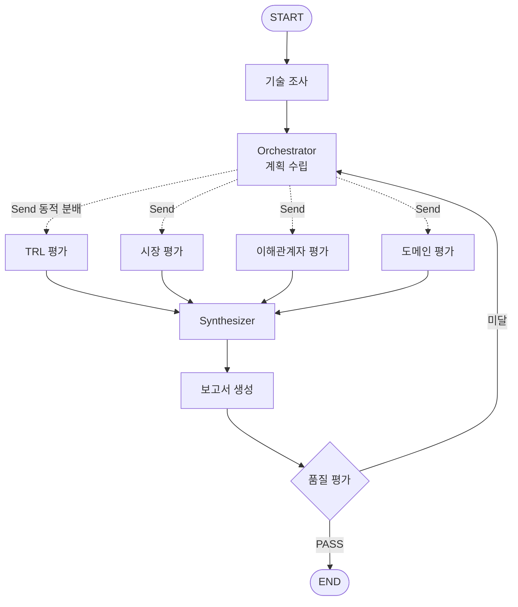

# Subject

본 프로젝트는 KV cache 최적화 기술을 소프트웨어, 하드웨어 두 진영에서 선정하여,
시장·이해관계자·도메인 관점에서 평가하는 **Orchestrator-Workers** 기반으로 설계/개발 하는 프로젝트 임.

## Overview

- **Objective** : 하나의 기술을 복수 관점에서 비교 평가 — 우열 판정이 아닌 **관점별 인식 차이** 규명
- **Pattern** : **Orchestrator-Workers**
  - 평가 작업이 `기술 × 관점` 조합으로 **분해 가능**하고, 각 조합이 서로 독립적이라 병렬 처리에 적합함
  - 보고서 생성이 목적이므로 **재현성**이 중요함. 매 스텝 라우팅을 재판단하는 Supervisor보다, 계획을 일괄 수립하고 병렬 실행하는 쪽이 실행 경로가 안정적임
  - 일부 관점 조사가 실패해도 **나머지 결과로 보고서를 완성**해야 하므로, Fan-in 시점의 Fall-back 설계가 자연스러움
- **동적 처리** : 고정 순서와 다른 점
  - **Workers가 코드에 선언되어 있지 않음.** Orchestrator가 수립한 계획(`plan`)을 읽어 `Send`로 분배하므로, **실행할 Worker의 종류와 개수가 런타임에 결정**됨
  - 계획은 **직전 단계의 결과에 의존**함. 자료 조사 결과의 근거 수준(`evidence_level`)이 낮은 기술에는 보강 조사 서브태스크가 **추가로 생성**됨
  - 보고서 품질 평가가 미달 판정을 내리면 **부족한 항목만** 재계획하여 2차 Fan-out을 수행함. **1차와 2차의 Worker 구성이 서로 다름**
  - 재계획 횟수는 상수로 제한함. Replan이 잦아지면 Orchestrator가 Supervisor로 수렴하므로, 패턴 정체성 유지를 위한 상한을 둠

## Selected Technologies

- **SW : DeepSeek-V2 (MLA)**
  사후 압축이 아닌 **어텐션 구조 단계에서 KV cache 발생량 자체를 줄이는** 접근 임.
  여러 head의 K/V를 공통 저차원 latent로 joint compression하며, up-projection을 query 측으로 흡수하여
  **복원 없이 latent 상태로 연산**함. MHA 대비 KV cache 93.3% 감소를 보고함.
  구조적 혁신이 있는 만큼 시스템 적용성·도입 복잡성 등 평가 가능한 관점이 다수 존재한다고 판단함.

- **HW : ITME (CXL-Hybrid Tiered Memory Expansion)**
  데이터를 줄이지 않고 **담을 공간만 변경하는** HW 확장 접근의 원형 임.
  NAND SSD를 바이트 주소 지정이 가능한 원격 메모리로 노출하여 TB급 KV cache 계층을 신설함.
  HW 확장의 대가(DRAM 캐시 2배 확장 시 온칩 SRAM 86.7% 증가)를 논문이 수치로 공개하고 있으며,
  NVIDIA·Samsung을 직접 겨냥·평가하여 **이해관계자 대립 구도를 1차 자료에서 확보 가능함.**

> **선정 기준은 기술적 우월성이 아님.** 병목을 어떤 자원과 교환하는지가 가장 선명하게 드러나고,
> 관점별 평가가 가장 크게 갈리는 사례인지를 기준으로 삼음.
> 동일한 이유로 InfiniGen(기존 호스트 메모리 위 SW 최적화에 근접)과
> PIM/CXL(연산 이동까지 포함하여 분석 범위 초과)은 선정하지 않음.

## Features

- **PDF 원문 기반 구조화 추출** — 두 논문(총 65p)에서 개요·메커니즘·범위·한계를 스키마에 맞춰 추출
- **기술별 인덱스 분리** — 논문 분량이 4배 차이(13p vs 52p)나므로, 공통 풀 사용 시 분량이 큰 쪽이 검색을 잠식함
- **표 보존 청킹** — 핵심 수치가 표에 집중되어 있어 표 블록은 분할하지 않음
- **웹 검색 기반 시장·이해관계자 조사** — 채택 현황, 경쟁사 반응, 투자 동향
- **관점별 독립 척도** — TRL(1-9) / 시장성(100점 환산) / 이해관계자(1-5점) / 도메인(가중 평균).
  기술별 특성 보존을 위해 척도를 강제 통일하지 않음
- **출처 추적** — 모든 평가 항목이 출처 ID를 보유하며, 보고서 REFERENCE 장까지 연결됨

### 확증 편향 방지 전략

평가 대상이 **개발 주체가 직접 작성한 문헌**이라는 점, 그리고 두 기술의 **자료량 격차가 크다**는 점이
본 프로젝트의 구조적 위험 임. 다음 장치로 대응함.

| 전략 | 내용 |
| --- | --- |
| **주장과 측정의 분리** | 논문의 주장(`claims`)과 실험 측정치(`measurements`)를 별도 저장하고, 수치에는 `baseline`과 `condition`을 필수로 요구함. ITME의 경우 Abstract의 "1.80×"는 NVMe-oF 대비이고 본문 실험 절의 "1.81×"는 재계산 대비이므로, 구분하지 않으면 보고서가 오인용하게 됨 |
| **환각 출처 차단** | LLM이 출력한 근거 식별자를 실제 검색 결과와 대조하여 불일치 항목을 폐기하고, 폐기 건수를 결과에 기록함 |
| **자리표시자 우회 차단** | `baseline`·`condition`을 `-`나 `N/A`로 채워 검증을 통과시키는 것을 차단하고, 해당 수치를 폐기함 |
| **암묵적 한계 역산** | 벤더 논문은 한계를 충분히 기술하지 않으므로, 평가 조건에서 역산한 한계를 별도 추출함. 실제로 ITME의 명시적 한계는 0건이었으며, 역산을 통해 "성능 향상이 특정 턴 구간에 집중됨"이라는 관찰을 확보함 |
| **"근거 없음"과 "부정적"의 분리** | 조사하였으나 확인하지 못한 항목은 `NOT_VERIFIED` / `NE`로 기록하여 최저점과 구분함. 자료가 적은 최신 기술이 구조적으로 불리해지는 **자료 가용성 편향**을 차단함 |
| **근거 불충분 시 판정 보류** | 도메인 관점은 근거 커버리지가 기준에 미달할 경우 점수를 산출하지 않고 **판정을 보류함** |
| **시점 비대칭 명시** | TRL에 문헌 발표일과 경과 기간을 병기함. DeepSeek-V2는 27개월, ITME는 3개월이므로 동일한 TRL 값을 동일한 의미로 해석해서는 안 됨 |
| **우열 판정 금지** | 관점 간 점수를 합산하지 않음. 종합 단계는 일치·불일치·trade-off만 도출함 |

### 보고서 품질 평가

보고서 생성 직후 **품질 평가 노드**가 네 항목을 검사하며, 미달 시 재계획 루프로 되돌림.

| 평가 항목 | 검사 내용 |
| --- | --- |
| **Groundedness** | 보고서의 주장이 수집된 출처 ID로 추적되는가 |
| **중립성** | 특정 기술에 대한 추천·우열 판정 표현이 없는가 |
| **편향 통제** | 단일 출처나 유리한 근거에 편중되지 않았는가 |
| **관점 커버리지** | 기술 성숙도·시장성·이해관계자·도메인 적용 4개 관점을 모두 포괄하는가 |

> **판정은 확률, 게이트는 결정론.** LLM Judge의 출력은 비결정적이지만, 그 판정을 받아
> 분기·재시도로 연결하는 **파이프라인 동작은 결정론적**으로 고정함.
> 재시도 횟수는 상수로 제한하여 무한 루프를 차단함.

<!-- TODO: 평가 방식(형식 검사 / LLM Judge / Hybrid) 확정 후 구체화 -->

## Tech Stack

- **Framework** : LangGraph (StateGraph, Dynamic Fan-out / Fan-in)
- **LLM/Generator** : gpt-4.1-mini (기술 조사·TRL·도메인) / gpt-5.6-luna (시장·이해관계자·보고서)
- **LLM/Judge** : gpt-4.1-nano (평가 종합) <!-- TODO: 품질 평가 노드 모델 확정 -->
- **Retrieval** : FAISS — **Hit Rate@5 0.88, MRR 0.721** (골든 QA 25문항 기준)
- **Embedding** : **BAAI/bge-m3** (오픈소스)
- **PDF Loader** : PyPDFLoader
- **Web Search** : Tavily
- **Observability** : LangSmith

### 로더·임베딩 선정 근거

두 선택 모두 **일반 권장을 따르지 않고 대상 문서에 직접 실험하여** 결정함.

| 선택 | 비교 대상 | 근거 |
| --- | --- | --- |
| **PyPDFLoader** | PyMuPDF · PDFPlumber · pymupdf4llm | 동일 임베딩·동일 골든 QA로 A/B 수행 결과 전 항목 1위(MRR 0.721). 일반 가이드는 "표가 많으면 PDFPlumber"를 권장하나, **본 문서군에서는 원문 2건이 소실**되어 배제함 |
| **bge-m3** | gte-multilingual · e5-large · MiniLM | 코퍼스 실측에서 요건을 역산 — 8192 컨텍스트(표+설명 문단을 단일 청크에 수용), 하이브리드 검색(수치 질의 대응), 다국어(한국어 질의 → 영어·중국어 원문) |

> 임베딩은 **리더보드 순위가 아닌 코퍼스 실측**에서 요건을 도출함.
> 예컨대 코퍼스 내에서 `93.3`이 "KV cache 93.3% 감소"(핵심)와 "ARC-Challenge 정확도 93.3"(무관)으로
> 동시에 존재함. 이러한 충돌이 실재하므로 **어휘 매칭 능력**이 요건이 됨.
> 또한 DeepSeek-V2 논문에는 중국어가 2,152자 포함되어 있어 다국어 지원이 필요함.

## Agents

| Agent | 역할 | RAG | 비고 |
| --- | --- | --- | --- |
| 🧭 **Orchestrator** | 자료 조사 결과를 바탕으로 **서브태스크 계획 수립**. 계획을 `Send`로 Worker에 동적 분배 | - | 패턴의 중심 |
| 🔍 기술 조사 | 두 기술 원문에서 개요·메커니즘·범위·한계 추출 | O | Orchestrator의 계획 입력을 생성하는 선행 단계 |
| 📐 TRL 평가 | 공개 근거 기반 기술 성숙도 **구간** 추정 | - | Worker |
| 📊 시장 평가 | 시장 규모·성장성, 경제적 가치, 채택 현황, 생태계 지지 | O | Worker |
| 🤝 이해관계자 평가 | 경쟁사 반응·도입 장벽·개발자 생태계·투자 동향 | X | Worker |
| 🏭 도메인 평가 | 데이터센터 적용 적합성 및 근거 신뢰도 | O | Worker |
| ⚖️ Synthesizer | Worker 결과를 **취합**하고 관점 간 일치·불일치·trade-off 도출 | X | Fan-in |
| 📝 보고서 생성 | 다관점 평가 보고서 작성 | X | |
| ✅ 품질 평가 | Groundedness·중립성·편향통제·관점커버리지 검사. 미달 시 재계획 | X | 게이트 |

### 설계 원칙

**Worker는 코드에 하드코딩하지 않음.** Orchestrator가 수립한 계획에서 런타임에 결정됨.
Worker 간 직접 통신은 없으며, 모든 결과는 State의 공유 키에 **리듀서로 병합**됨.

**기술 조사는 Worker가 아니라 선행 단계임.** 네 관점 평가가 모두 기술 조사 결과를 입력으로 받으므로,
이를 Worker로 분배하면 Worker 간 의존성이 생겨 병렬 Fan-out 모델과 충돌함.
따라서 **계획의 입력을 만드는 전처리**로 배치함.

**원본과 요약을 분리함.** 조사 원문은 누적 보존하되 에이전트 간 통신에는 요약만 전달하고,
최종 보고서는 State에 본문을 담지 않고 **참조 경로**만 유지함.

## State Schema

<!-- TODO: State 설계 확정 후 7개 항목 각각에 대한 설계 근거를 한 줄씩 작성
- 제어 vs 페이로드 분리 :
- 관측성 위치 :
- 지속성 비용 :
- 상관 :
- 재개/복구 :
- 동시 처리 :
- 종료 보장 :
-->

## Architecture

<!-- TODO: 그래프 이미지 삽입 -->


```mermaid
graph TD;
    START([START]) --> TR[기술 조사]
    TR --> OR[Orchestrator<br/>계획 수립]
    OR -. Send 동적 분배 .-> W1[TRL 평가]
    OR -. Send .-> W2[시장 평가]
    OR -. Send .-> W3[이해관계자 평가]
    OR -. Send .-> W4[도메인 평가]
    W1 --> SY[Synthesizer]
    W2 --> SY
    W3 --> SY
    W4 --> SY
    SY --> RP[보고서 생성]
    RP --> QG{품질 평가}
    QG -- PASS --> END([END])
    QG -- 미달 --> OR
```

## Directory Structure

```
├── data/                          # 원문 PDF 2건(65p) + 관점별 평가 루브릭 JSON
├── agents/                        # Agent 모듈
├── rag/                           # 공용 RAG 파이프라인 (로더·청킹·임베딩·검색기)
├── prompts/                       # 프롬프트 템플릿
├── outputs/                       # 실행 결과 저장
├── app.py                         # LangGraph 구성 및 실행
└── README.md
```

## Usage

```bash
uv venv .venv --python 3.11
uv sync
cp .env.example .env    # OPENAI_API_KEY, TAVILY_API_KEY, LANGSMITH_API_KEY 설정
python app.py
```

> 전역 Python 환경에서 실행 시 의존성 충돌로 API 호출이 실패할 수 있으므로 **가상환경 사용을 권장함.**
> 최초 실행 시 임베딩 모델(약 2.2GB)을 다운로드하고 FAISS 인덱스를 생성하며, 이후에는 캐시를 재사용함.

## Contributors

판교캠퍼스 10반 3조

| 학번 | 이름 | 수행 역할 |
| --- | --- | --- |
| P318 | 김인성 |  |
| P336 | 이윤서 | state schema 정리|
| P343 | 함형준 | 전체 코드 간소화 리팩토링, 보고서 출력 형식 개선 |
| P344 | 황영준 | README.md 수정, LangSmith 정리 |
| P346 | 황정현 |  |

> P316 김령아 — 결석
