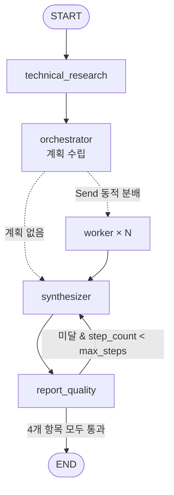

# Subject

본 프로젝트는 KV cache 최적화 기술을 소프트웨어, 하드웨어 두 진영에서 선정하여,
시장·이해관계자·도메인 관점에서 평가하는 **Orchestrator-Workers** 기반으로 설계/개발 하는 프로젝트 임.

## Overview

- **Objective** : 하나의 기술을 복수 관점에서 비교 평가 — 우열 판정이 아닌 **관점별 인식 차이** 규명
- **Pattern** : **Orchestrator-Workers**
  - 평가 작업이 `관점 × 기술` 조합으로 **분해 가능**하고 각 조합이 서로 독립적이라 병렬 처리에 적합함
  - 산출물이 보고서이므로 **재현성**이 중요함. 매 스텝 라우팅을 재판단하는 Supervisor보다, 계획을 일괄 수립하고 병렬 실행하는 쪽이 실행 경로가 안정적임
  - 일부 관점 조사가 실패해도 **나머지 결과로 보고서를 완성**해야 하므로, Worker 단위 Fall-back 설계가 자연스러움
- **동적 처리** : 고정 순서와 다른 점
  - **Worker 목록이 코드에 선언되어 있지 않음.** `orchestrator` 노드가 LLM 구조화 출력으로 `plan`을 생성하고, `assign_workers`가 이를 읽어 `Send`로 분배하므로 **실행할 Worker의 종류·개수·입력이 런타임에 결정**됨
  - 계획은 **직전 단계 결과에 의존**함. `technical_research` 산출물과 누적된 `errors`를 planner 입력으로 넣어, 조사 상태에 따라 작업 구성이 달라짐
  - 각 Worker는 `plan`이 지정한 `tech_ids`에 해당하는 자료만 받음. **같은 관점이라도 기술별로 분할**되거나 묶일 수 있음
  - 보고서 품질 평가가 미달 판정을 내리면 `route_report_quality`가 **재작성 경로로 분기**함. 통과 시 종료, 미달 시 `synthesizer` 재진입으로 **실행 경로 자체가 달라짐**
  - 재작성 횟수는 `max_steps`로 제한함. Replan이 잦아지면 Orchestrator가 Supervisor로 수렴하므로 상한을 둠

## Selected Technologies

- **SW : DeepSeek-V2 (MLA)**
  사후 압축이 아닌 **어텐션 구조 단계에서 KV cache 발생량 자체를 줄이는** 접근 임.
  여러 head의 K/V를 공통 저차원 latent로 joint compression하며, up-projection을 query 측으로 흡수하여
  **복원 없이 latent 상태로 연산**함. MHA 대비 KV cache 93.3% 감소를 보고함.
  구조적 혁신이 있는 만큼 시스템 적용성·도입 복잡성 등 평가 가능한 관점이 다수 존재한다고 판단함.

- **HW : ITME (CXL-Hybrid Tiered Memory Expansion)**
  데이터를 줄이지 않고 **담을 공간만 변경하는** HW 확장 접근의 원형 임.
  NAND SSD를 바이트 주소 지정이 가능한 원격 메모리로 노출하여 TB급 KV cache 계층을 신설함.
  HW 확장의 대가(DRAM 캐시 2배 확장 시 온칩 SRAM 86.7% 증가)를 논문이 수치로 공개하고 있으며,
  NVIDIA·Samsung을 직접 겨냥·평가하여 **이해관계자 대립 구도를 1차 자료에서 확보 가능함.**

> **선정 기준은 기술적 우월성이 아님.** 병목을 어떤 자원과 교환하는지가 가장 선명하게 드러나고,
> 관점별 평가가 가장 크게 갈리는 사례인지를 기준으로 삼음.
> 동일한 이유로 InfiniGen(기존 호스트 메모리 위 SW 최적화에 근접)과
> PIM/CXL(연산 이동까지 포함하여 분석 범위 초과)은 선정하지 않음.

## Features

- **PDF 원문 기반 구조화 추출** — 두 논문(총 65p)에서 개요·메커니즘·범위·한계를 스키마에 맞춰 추출
- **기술별 인덱스 분리** — 논문 분량이 4배 차이(13p vs 52p)나므로, 공통 풀 사용 시 분량이 큰 쪽이 검색을 잠식함
- **표 보존 청킹** — 핵심 수치가 표에 집중되어 있어 표 블록은 분할하지 않음
- **웹 검색 기반 시장·이해관계자 조사** — 채택 현황, 경쟁사 반응, 투자 동향
- **관점별 독립 척도** — TRL(1-9) / 시장성(100점 환산) / 이해관계자(1-5점) / 도메인(가중 평균).
  기술별 특성 보존을 위해 척도를 강제 통일하지 않음
- **출처 추적** — 각 평가 항목이 출처 ID를 보유하고, 보고서 문단마다 인용 ID를 최대 5개로 제한하여 REFERENCE까지 연결됨
- **Worker 단위 Fall-back** — 한 Worker가 실패해도 `status: FAILED`와 에러만 기록하고 나머지 결과로 진행함

### 확증 편향 방지 전략

평가 대상이 **개발 주체가 직접 작성한 문헌**이라는 점, 그리고 두 기술의 **자료량 격차가 크다**는 점이
본 프로젝트의 구조적 위험 임. 다음 장치로 대응함.

| 전략 | 내용 |
| --- | --- |
| **주장과 측정의 분리** | 논문의 주장(`claims`)과 실험 측정치(`measurements`)를 별도 저장하고, 수치에는 `baseline`과 `condition`을 필수로 요구함. ITME의 경우 Abstract의 "1.80×"는 NVMe-oF 대비이고 본문 실험 절의 "1.81×"는 재계산 대비이므로, 구분하지 않으면 보고서가 오인용하게 됨 |
| **환각 출처 차단** | LLM이 출력한 근거 식별자를 실제 검색 결과와 대조하여 불일치 항목을 폐기하고, 폐기 건수를 결과에 기록함 |
| **자리표시자 우회 차단** | `baseline`·`condition`을 `-`나 `N/A`로 채워 검증을 통과시키는 것을 차단하고, 해당 수치를 폐기함 |
| **암묵적 한계 역산** | 벤더 논문은 한계를 충분히 기술하지 않으므로, 평가 조건에서 역산한 한계를 별도 추출함. 실제로 ITME의 명시적 한계는 0건이었으며, 역산을 통해 "성능 향상이 특정 턴 구간에 집중됨"이라는 관찰을 확보함 |
| **"근거 없음"과 "부정적"의 분리** | 조사하였으나 확인하지 못한 항목은 `NOT_VERIFIED` / `NE`로 기록하여 최저점과 구분함. 자료가 적은 최신 기술이 구조적으로 불리해지는 **자료 가용성 편향**을 차단함 |
| **근거 불충분 시 판정 보류** | 도메인 관점은 근거 커버리지가 기준에 미달할 경우 점수를 산출하지 않고 **판정을 보류함** |
| **시점 비대칭 명시** | TRL에 문헌 발표일과 경과 기간을 병기함. DeepSeek-V2는 27개월, ITME는 3개월이므로 동일한 TRL 값을 동일한 의미로 해석해서는 안 됨 |
| **인용 범위 제한** | 보고서 문단마다 그 주장을 **직접 뒷받침하는 출처 ID만 최대 5개** 인용하도록 제한하여, 전체 출처 목록을 복사해 근거를 부풀리는 것을 차단함 |
| **우열 판정 금지** | 관점 간 점수를 합산하지 않음. 종합 단계는 일치·불일치·trade-off만 도출함 |

### 보고서 품질 평가

`synthesizer`가 보고서를 작성한 직후 **`report_quality` 노드**가 보고서와 원자료를 대조하여 네 항목을
구조화 출력(`ReportQuality`)으로 판정함. 하나라도 `False`면 `synthesizer`로 되돌려 재작성함.

| 평가 항목 | 검사 내용 |
| --- | --- |
| **Groundedness** | 보고서의 주장이 수집된 출처로 추적되는가 |
| **중립성** | 특정 기술에 대한 추천·우열 판정이 없는가 |
| **편향 통제** | 단일 출처나 유리한 근거에 편중되지 않았는가 |
| **관점 커버리지** | 기술 성숙도·시장성·이해관계자·도메인 적용 4개 관점을 포괄하는가 |

**판정 방식은 LLM Judge(2안)** 이며, 분기는 결정론으로 고정함.

> **판정은 확률, 게이트는 결정론.** Judge 출력은 비결정적이지만, 그 결과를 받아 분기·재시도로
> 연결하는 `route_report_quality`의 동작은 **네 항목이 모두 `True`면 종료, 아니면 재작성**으로 고정됨.
> 재작성은 `step_count < max_steps`일 때만 허용하여 무한 루프를 차단하고,
> Judge 자체가 실패해 판정이 비어 있으면 **재생성하지 않고 종료**하여 비용 폭증을 막음.

## Tech Stack

- **Framework** : LangGraph (StateGraph, `Send` 기반 Dynamic Fan-out / Fan-in)
- **LLM/Generator** : gpt-4.1-nano (Planner) / gpt-4.1-mini (기술 조사·TRL·도메인) / gpt-5.6-luna (시장·이해관계자·종합)
- **LLM/Judge** : gpt-5.6-luna (보고서 품질 평가)
- **Retrieval** : FAISS — **Hit Rate@5 0.88, MRR 0.721** (골든 QA 25문항 기준)
- **Embedding** : **BAAI/bge-m3** (오픈소스)
- **PDF Loader** : PyPDFLoader
- **Web Search** : Tavily
- **Observability** : LangSmith (`run_id`로 State와 Trace 상관)

### 로더·임베딩 선정 근거

두 선택 모두 **일반 권장을 따르지 않고 대상 문서에 직접 실험하여** 결정함.

| 선택 | 비교 대상 | 근거 |
| --- | --- | --- |
| **PyPDFLoader** | PyMuPDF · PDFPlumber · pymupdf4llm | 동일 임베딩·동일 골든 QA로 A/B 수행 결과 전 항목 1위(MRR 0.721). 일반 가이드는 "표가 많으면 PDFPlumber"를 권장하나, **본 문서군에서는 원문 2건이 소실**되어 배제함 |
| **bge-m3** | gte-multilingual · e5-large · MiniLM | 코퍼스 실측에서 요건을 역산 — 8192 컨텍스트(표+설명 문단을 단일 청크에 수용), 하이브리드 검색(수치 질의 대응), 다국어(한국어 질의 → 영어·중국어 원문) |

> 임베딩은 **리더보드 순위가 아닌 코퍼스 실측**에서 요건을 도출함.
> 예컨대 코퍼스 내에서 `93.3`이 "KV cache 93.3% 감소"(핵심)와 "ARC-Challenge 정확도 93.3"(무관)으로
> 동시에 존재함. 이러한 충돌이 실재하므로 **어휘 매칭 능력**이 요건이 됨.
> 또한 DeepSeek-V2 논문에는 중국어가 2,152자 포함되어 있어 다국어 지원이 필요함.

## Agents

| Node | 역할 | RAG | 비고 |
| --- | --- | --- | --- |
| 🔍 `technical_research` | 두 기술 원문에서 개요·메커니즘·범위·한계 추출 | O | 계획의 입력을 만드는 선행 단계 |
| 🧭 **`orchestrator`** | 조사 결과와 평가 목표를 읽어 **독립 실행 가능한 작업으로 분해**. `Plan` 구조화 출력 | - | **패턴의 중심** |
| ⚡ `assign_workers` | `plan`을 읽어 `Send`로 Worker에 **동적 분배** | - | 조건부 엣지 |
| 👷 `worker` | 배정된 작업 하나를 실행. 실패 시 `FAILED` 기록 후 계속 | O/X | TRL·시장·이해관계자·도메인 평가를 수행 |
| ⚖️ `synthesizer` | Worker 결과를 종합하고 보고서를 작성하여 **파일로 저장** | X | Fan-in |
| ✅ `report_quality` | 보고서와 원자료를 대조해 **네 품질 항목 판정** | X | 게이트 |
| ↩️ `route_report_quality` | 판정 결과와 `step_count`로 **재작성/종료 결정** | - | 조건부 엣지 |

### 설계 원칙

**Worker는 코드에 하드코딩하지 않음.** `AGENTS` 레지스트리는 실행 가능한 함수 목록일 뿐이고,
**어떤 Worker를 몇 개 띄울지는 `plan`이 결정**함. Worker 간 직접 통신은 없으며,
모든 결과는 `results` 키에 리듀서로 병합됨.

**기술 조사는 Worker가 아니라 선행 단계임.** 네 관점 평가가 모두 기술 조사 결과를 입력으로 받으므로,
이를 Worker로 분배하면 Worker 간 의존성이 생겨 병렬 Fan-out 모델과 충돌함.
따라서 **계획의 입력을 만드는 전처리**로 배치함.

**취합과 생성을 분리함.** `results`는 Worker의 산출물을 모으는 데까지만 쓰고,
보고서 생성은 `synthesizer`가 담당함. 보고서 본문은 State에 담지 않고 **`report_uri`로 경로만** 유지함.

## State Schema

`OrchestratorState`(상위 흐름)와 `WorkerState`(작업 단위)로 **계층 분리**함.
State Schema는 `TypedDict`, 노드의 구조화 출력은 `Pydantic BaseModel`로 분리함.

| 항목 | 설계 반영 |
| --- | --- |
| **제어 vs 페이로드 분리** | 조정에 필요한 제어 메타(`plan`·`status`·`step_count`·`max_steps`·`run_id`)와 작업 산출물(`results`·`report_uri`·`quality`)을 같은 State 안에서 **블록으로 구분**하고, 제어 메타는 Orchestrator만 갱신함. Worker는 `WorkerState`의 `task`·`task_input`만 받아 **자신이 쓸 키(`results`·`errors`)만 반환**함 |
| **관측성 위치** | 결정 로그 본문은 State에 담지 않고 **LangSmith 트레이스로 분리**함. State에는 판정 결과(`quality`)와 에러 요약(`errors`)만 남기며, `errors`는 예외 유형·단계만 기록하여 요청 본문이나 인증 정보가 섞이지 않게 함 |
| **지속성 비용** | 보고서 전문은 State에 넣지 않고 파일로 저장한 뒤 **`report_uri` 경로만 유지**함. 보고서 문단의 인용은 **출처 ID 최대 5개**로 제한하여 전체 출처 목록이 복사되지 않게 하고, 재작성 시에도 이전 보고서를 경로로 읽어 들여 State 증식을 막음 |
| **상관** | 실행 시작 시 `run_id`(UUID)를 생성해 **State와 LangSmith `config`의 `run_id`·`metadata`에 동일 값**을 전달함. 트레이스 화면의 실행 ID와 State·보고서가 같은 키로 연결되어, 사후에 어떤 실행의 산출물인지 추적 가능함 |
| **재개/복구** | Worker는 실패해도 예외를 밖으로 던지지 않고 `status: FAILED`와 `errors`를 남긴 뒤 **부분 결과로 계속 진행**함. `status`(`WORKING`·`PARTIAL`·`FAILED`)와 `errors`가 남아 있어, 어느 단계가 불완전했는지 보고서와 State에서 확인 가능함 |
| **동시 처리** | `Send`로 동시에 뜬 Worker들이 **같은 `results` 키에 기록**하므로 `Annotated[list[dict], operator.add]` 리듀서로 병합함. `errors`도 동일하게 누적 리듀서를 둠. 각 Worker는 `task_id`를 함께 반환하여 **도착 순서에 의존하지 않고** 결과를 식별함 |
| **종료 보장** | 품질 미달 시 `synthesizer` 재진입 루프가 생기므로, `step_count`(보고서 생성 횟수)와 `max_steps`(기본 2 = 초안 + 수정 1회)를 **코드에서 비교**해 종료를 강제함. 종료 판단을 모델에 위임하지 않으며, Judge가 실패해 판정이 비면 **재생성하지 않고 종료**함 |

## Architecture



```mermaid
graph TD;
    START([START]) --> TR[technical_research]
    TR --> OR[orchestrator<br/>계획 수립]
    OR -. Send 동적 분배 .-> W[worker × N]
    OR -. 계획 없음 .-> SY[synthesizer]
    W --> SY
    SY --> RQ[report_quality]
    RQ -- 4개 항목 모두 통과 --> END([END])
    RQ -- 미달 & step_count < max_steps --> SY
```

## Directory Structure

```
├── data/                          # 원문 PDF 2건(65p) + 관점별 평가 루브릭 JSON
├── agents/                        # Agent 모듈
│   ├── state.py                   # OrchestratorState / WorkerState
│   ├── technical_research.py      # 기술 조사 + TRL 평가
│   ├── market_evaluation.py
│   ├── stakeholder_evaluation.py
│   ├── domain_evaluation.py
│   ├── synthesizer.py             # Fan-in 취합 + 보고서 작성
│   ├── report_quality.py          # 품질 평가 + 라우팅
│   └── resilient.py               # 부분 실패 기록·보존
├── rag/                           # 공용 RAG 파이프라인 (로더·청킹·임베딩·검색기)
├── prompts/                       # 프롬프트 템플릿
├── outputs/                       # 실행 결과 저장
├── app.py                         # LangGraph 구성 및 실행
└── README.md
```

## Usage

```bash
uv venv .venv --python 3.11
uv sync
cp .env.example .env    # OPENAI_API_KEY, TAVILY_API_KEY, LANGSMITH_API_KEY 설정
python app.py
```

> 전역 Python 환경에서 실행 시 의존성 충돌로 API 호출이 실패할 수 있으므로 **가상환경 사용을 권장함.**
> 최초 실행 시 임베딩 모델(약 2.2GB)을 다운로드하고 FAISS 인덱스를 생성하며, 이후에는 캐시를 재사용함.

실행이 끝나면 보고서 경로, LangSmith 실행 ID, 최종 상태, 품질 평가 결과가 출력됨.

## Contributors

판교캠퍼스 10반 3조

| 학번 | 이름 | 수행 역할 |
| --- | --- | --- |
| P318 | 김인성 | Orchestrator 패턴 설계 및 적용 |
| P336 | 이윤서 | State Schema 정리 |
| P343 | 함형준 | 전체 코드 간소화 리팩토링, 보고서 출력 형식 개선 |
| P344 | 황영준 | README 작성, LangSmith 정리 |
| P346 | 황정현 | 워크플로 기반 구조 설계 및 품질 평가 |

> P316 김령아 — 결석
