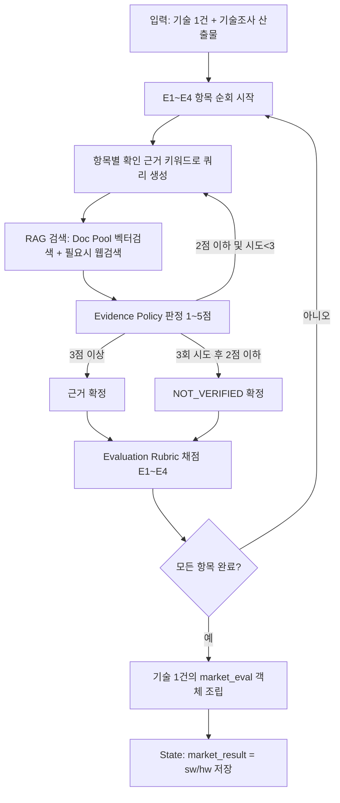

# KV Cache 최적화 기술 다관점 평가 — 시장성 관점 설계서

## 1. 배경

KV cache 최적화 기술(SW 압축 vs HW 메모리 접근)을 LangGraph 기반 Multi Agent + Agentic RAG로 다관점 평가한다. 본 문서는 그중 **시장성 관점**의 평가 체계와 평가 에이전트 워크플로우를 정의한다.

평가의 목적은 우열 판정이 아니라, 하나의 기술이 관점에 따라 어떻게 다르게 인식되는지를 조사·비교·대조하는 것이다.

---

## 2. 평가 체계 구조: 2-레이어 분리

각 관점은 서로 다른 것을 재는 두 개의 독립된 레이어로 구성된다.

| 레이어 | 측정 대상 | 총점에 반영 여부 |
| --- | --- | --- |
| **Evaluation Rubric** | 시장이 이 기술을 실제로 어떻게 인식·수용하는가 (판단 자체) | O — 관점 총점 |
| **Evidence Policy** | 그 판단을 뒷받침하는 근거가 얼마나 탄탄한가 (근거 품질) | X — 신뢰도 태그로만 별도 표기 |

두 레이어는 함께 출력되어, 예를 들어 "시장 규모는 크게 보이지만(4점) 근거는 약하다(약함)"처럼 판단과 확신 수준을 분리해서 기록한다. Evidence Policy는 동시에 **검색 에이전트의 종료 조건**으로도 재사용된다.

---

## 3. 평가 범위 (Scope)

**시장성 관점은 데이터센터·클라우드 서빙 환경을 기준 시장으로 삼는다.** KV cache 문제 자체가 HBM 용량 소진이라는 데이터센터 인프라 이슈에서 출발하기 때문이며, GPU·HBM·TCO 등 인프라 비용 지표가 이를 반영한다. 이는 의도적 스코프 제한이다.

- 도메인 평가 에이전트는 데이터센터를 별도로 재평가하지 않고, 시장성 관점의 결과를 **데이터센터 기준선**으로 참조한다.
- 도메인 에이전트의 역할은 이 기준선 대비 OnDevice AI, 장문맥 처리 어플리케이션 등 다른 도메인에서는 평가가 어떻게 달라지는지를 비교하는 것으로 한정된다.
- 종합 에이전트는 시장성 관점 결과를 데이터센터 기준선으로 간주하고, 도메인 평가와의 차이를 상충 지점으로 표시한다.

---

## 4. Evaluation Rubric (시장성 관점, E1~E4)

**배점 및 환산 규칙**
- 4개 항목을 1~5점으로 평가하며 동일 비중으로 반영한다.
- `100점 환산 총점 = 획득 점수 합계 ÷ 20 × 100`
- 4개 항목은 모두 적용 대상이며, 항목별 조사가 끝난 상태를 전제로 하므로 적용 제외 항목은 두지 않는다.

### E1. 시장이 이 기술의 문제 영역을 크고 빠르게 성장하는 영역으로 보는가?

- **주요 확인 근거:** TAM·SAM 또는 관련 상위 시장 규모, CAGR / Context Length·동시성·Agent·RAG 등 워크로드 증가 지표
- **주의 사항:** 서로 다른 시장 범주에 있는 기술 간 시장 규모를 직접 비교하지 않는다.

| 점수 | 평가 기준 |
| --- | --- |
| 5 | 대상(또는 관련 상위) 시장 규모가 크고 CAGR이 두 자릿수 이상인 고성장 구간이며, 관련 워크로드 지표도 뚜렷한 증가 추세로 나타남 |
| 4 | 시장 규모가 중견 이상이고 성장세가 뚜렷하며, 워크로드 증가 신호도 함께 관찰됨 |
| 3 | 특정 세그먼트에서는 성장이 뚜렷하나 전체 시장 규모·성장률은 중간 수준이거나 워크로드 연결이 간접적임 |
| 2 | 시장 규모가 작거나 성장세가 완만하며 수요 증가 신호가 약함 |
| 1 | 시장이 형성되지 않았거나 정체·위축 추세이며 수요 증가 신호가 없음 |

### E2. 시장이 이 기술의 비용·성능 효과를 실질적인 경제적 가치로 인식하는가?

- **주요 확인 근거:** 메모리 감소량, 지연시간, 처리량, GPU 수, $/token, TCO 등 baseline 대비 개선폭
- **주의 사항:** KV Cache 감소량을 비용 감소량과 동일시하지 않는다. 서로 다른 baseline 수치를 직접 비교하지 않는다.

| 점수 | 평가 기준 |
| --- | --- |
| 5 | 복수 차원(메모리·지연·처리량 등)에서 baseline 대비 수 배 이상 개선이 확인되고, TCO·$/token 등 구체적 비용 지표까지 이어짐 |
| 4 | 특정 차원에서 뚜렷한 개선이 있으나 비용 지표까지는 연결되지 않음 |
| 3 | 개선 효과는 있으나 특정 조건·환경에 한정되거나 규모가 제한적임 |
| 2 | 개선 효과가 미미하거나 정성적 언급 수준에 그침 |
| 1 | 비용·경제적 효과가 확인되지 않음 |

### E3. 시장이 이 기술을 실제 채택·상용화 단계까지 받아들였는가?

- **주요 확인 근거:** 실제 상용 서비스·제품, 독립적인 도입 주체, 하이퍼스케일러 발표, Pilot·PoC, 공개 서비스 적용
- **주의 사항:** 논문·프로토타입은 상용화 사례로 분류하지 않는다.

| 점수 | 평가 기준 |
| --- | --- |
| 5 | 서로 독립적인 복수 주체가 실제 상용 서비스·제품에 적용 중임 |
| 4 | 최소 1건의 상용 적용, 또는 주요 기업·하이퍼스케일러의 채택이 확인됨 |
| 3 | 고객 Pilot·PoC 또는 공개 서비스 적용 단계에 있음 |
| 2 | 제품 로드맵·발표·논문·프로토타입 수준에 머물러 있음 |
| 1 | 채택·상용화 움직임이 없음 |

### E4. 개발 주체를 넘어선 생태계가 이 기술을 지지하고 있는가?

- **주요 확인 근거:** 제3자 Serving Framework 지원, 커뮤니티 포트, 독립 구현 / 표준화 활동, 산업 참여 / 타 KV Cache 기술과의 실제 결합 사례
- **주의 사항:** 결합 가능성은 이론적 언급이 아니라 실제 사례·연구 기준으로 판단한다.

| 점수 | 평가 기준 |
| --- | --- |
| 5 | 개발 주체 외 2개 이상 조직의 공식 지원 또는 표준화·산업 참여가 확인되고, 타 기술과의 실제 결합 사례가 2건 이상임 |
| 4 | 개발 주체 외 1개 조직의 지원, 또는 표준화·산업 참여 중 하나가 확인되고 결합 사례가 1건 이상임 |
| 3 | 제3자 구현·커뮤니티 포트·독립 평가 버전이 존재하거나 결합 가능성 연구가 존재함 |
| 2 | 원 개발 조직의 구현만 존재하거나 표준·확장 가능성이 단순 언급 수준임 |
| 1 | 생태계 지지 근거가 없음 |

---

## 5. Evidence Policy (시장성 관점 공통, 1~5점 척도)

**목적**: Evaluation Rubric(E1~E4)의 각 판단이 얼마나 탄탄한 근거로 뒷받침되는지를 측정한다. Evaluation Rubric의 1~5점 자체에는 영향을 주지 않으며, 그 판단의 확신 수준(신뢰도 태그)만 결정한다. E1~E4 각 항목마다 개별적으로 적용한다.

**검색 종료 조건으로도 활용**: 항목별 판정 점수가 3점 이상이면 해당 항목 검색을 종료하고 근거를 확정한다. 2점 이하면 쿼리를 바꿔 재검색하고, 최대 3회 시도 후에도 2점 이하면 검색을 종료하고 NOT_VERIFIED로 기록한다.

### 근거 품질 판정 기준

| 점수 | 판정 기준 |
| --- | --- |
| 5 | 2개 이상의 독립 출처가 서로 일치하는 수치·주장을 제시하고, 기준 시점·범위가 명확하며 출처 성격(피어리뷰/벤더/공식발표 등)이 구분되어 있음 |
| 4 | 독립 출처는 1~2개이나 신뢰할 만하며, 기준 시점·범위 표기가 대체로 되어 있음 |
| 3 | 출처가 1개뿐이거나, 서로 다른 출처의 수치가 정합성 없이 병기됨 |
| 2 | 출처는 있으나 신뢰성·독립성이 낮음 (홍보성 자료, 미검증 커뮤니티 글 등) |
| 1 | 출처가 없거나 확인이 불가능함 |

### 감점 규칙 (판정 점수에서 단계 하향, 최저 1점)

| 감점 사유 | 감점 폭 | 주로 해당하는 항목 |
| --- | --- | --- |
| Vendor Benchmark를 독립 검증으로 제시 | -2단계 | 전체 |
| 서로 다른 baseline의 수치를 직접 비교 | -2단계 | E2 |
| KV Cache 감소량을 비용 감소량과 동일시 | -2단계 | E2 |
| 논문·프로토타입을 상용화 사례로 분류 | -2단계 | E3 |
| 출처 없는 정량 수치 | -1단계 | 전체 |
| 현재 상태와 전망·계획을 구분하지 않음 | -1단계 | 전체 |
| 정량 수치의 기준 시점을 명시하지 않음 | -1단계 | 전체 |

동일한 사실관계가 최저점 기준과 감점 규칙에 동시에 해당하면 이중 감점하지 않는다.

### NOT_VERIFIED 처리

- `NOT_VERIFIED`: 항목은 적용 가능하지만 충분히 조사한 뒤에도 근거를 확인하지 못했을 때 사용한다. 이 경우 Evaluation Rubric 점수는 1점으로 처리한다.
- 출처를 찾지 못한 경우에도 항목을 제외하지 않고 `NOT_VERIFIED`로 기록한다.

### 신뢰도 태그 환산

| 최종 점수 | 신뢰도 태그 |
| --- | --- |
| 5 | 강함 |
| 3~4 | 보통 |
| 1~2 | 약함 |
| NOT_VERIFIED | (Evaluation Rubric 1점 처리, 태그도 NOT_VERIFIED로 기록) |

---

## 6. 시장성 평가 에이전트 워크플로우

기술 1건당 한 번 호출되며, E1~E4를 순회하면서 항목마다 "검색 → 근거 판정 → 종료 또는 재검색 → 루브릭 채점"을 반복한다.



### 단계별 설명

1. **입력**: 기술 조사 에이전트가 넘긴 개요·범위·한계 + 평가 범위 전제("데이터센터·클라우드 서빙 기준 시장")를 시스템 프롬프트에 고정 주입한다.
2. **항목 순회**: E1(시장 규모·성장) → E2(비용·성능 효과) → E3(채택·상용화) → E4(생태계 지지) 순서로 처리한다. 항목마다 "주요 확인 근거" 키워드 목록을 검색 쿼리 시드로 사용한다.
3. **RAG 검색**: Doc Pool에서 관련 청크를 우선 검색하고(기술 조사 에이전트와 임베딩 모델 공유), TAM·CAGR·채택 사례처럼 Pool에 없는 시장 데이터는 웹검색으로 보강한다.
4. **Evidence Policy 판정 = 종료 조건**: 검색 결과를 Evidence Policy 표(5/4/3/2/1)로 채점한다.
   - 3점 이상 → 해당 항목 검색 종료, 근거 확정
   - 2점 이하이고 시도 3회 미만 → 쿼리를 다르게 재구성해 재검색
   - 3회 시도 후에도 2점 이하 → NOT_VERIFIED로 확정하고 다음 항목으로 이동 (무한 루프 방지)
5. **Evaluation Rubric 채점**: 확정된 근거(또는 NOT_VERIFIED)를 바탕으로 해당 항목의 1~5점 기준표에 맞춰 점수와 판단 근거 요약을 생성한다. NOT_VERIFIED면 자동 1점 처리한다.
6. **결과 저장**: 항목마다 `{item, score, evidence_score, confidence_tag, sources[], rationale}` 구조로 남긴다.
7. **4항목 완료 후 조립**: 기술 1건의 총점(`획득 점수 합계÷20×100`)과 항목별 상세를 `market_eval` 객체로 묶는다.
8. **State 저장**: SW·HW 기술을 앵커링 방지 목적으로 각각 독립 평가하되, 노드는 `app.py`에서 한 번만 호출되므로 내부에서 두 기술을 순회한다. 결과는 단일 키 `market_result = {"sw": {...}, "hw": {...}}`에 담아 평가 종합 에이전트가 나란히 비교할 수 있게 한다. (구체 형태는 §8 제안사항 참고)

### 출력 스키마 예시

```json
{
  "technology": "DeepSeek-V2 (MLA)",
  "market_eval": {
    "E1": {"score": 4, "evidence_score": 5, "confidence_tag": "강함", "sources": ["..."], "rationale": "..."},
    "E2": {"score": 3, "evidence_score": 2, "confidence_tag": "약함", "sources": ["..."], "rationale": "..."},
    "E3": {"score": 4, "evidence_score": 4, "confidence_tag": "보통", "sources": ["..."], "rationale": "..."},
    "E4": {"score": 1, "evidence_score": null, "confidence_tag": "NOT_VERIFIED", "sources": [], "rationale": "..."},
    "total_100": 60
  }
}
```

---

## 7. 제안사항 (구현 시 구체화)

`agents/state.py`의 State Key와 출력 스키마는 아직 확정되지 않았으므로, 아래 항목은 구현 단계에서 구체화할 **제안**으로 남긴다.

### 7.1 State 계약 (제안)

현재 `agents/state.py`에서 시장 평가 노드가 선언한 출력 키는 `market_result` 하나다. 시장 평가 노드는 자신이 생성한 키만 반환한다는 협업 규칙(규칙 3)에 맞춰 다음 형태를 제안한다.

- 입력: `technical_result`(기술 조사 산출물, `tech_id` → `TechProfile`), `selected_technologies`
  - `technical_result`는 `tech_id`(`deepseek_v2_mla` \| `itme`)를 키로 하고 `camp`(SW/HW)·`title`·
    `overview`·`mechanism`·`scope`·`claims`·`measurements`·`limits_explicit`·`limits_implicit`·
    `evidence_level`·`retrieval`을 담는다(정의: `agents/TECHNICAL_RESULT_SCHEMA.md`).
  - 시장 평가는 `technical_result`와 동일하게 `tech_id`를 결과 키로 사용해 하류 Node와 키 체계를
    통일한다. `3-2-b`(비용·성능 효과)는 `measurements`를 우선 근거로 사용하며, `claims`(요약
    주장)와 `measurements`(실험 측정치)는 섞지 않는다.
- 출력:
  - `market_result`: 기술별 dict(**`tech_id` 키**)

    ```python
    market_result = {
        "deepseek_v2_mla": {"technology": "DeepSeek-V2 MLA", "tech_id": "deepseek_v2_mla",
                            "camp": "SW", "score": 62.5, "rationale": "...", "evidence": [...],
                            "items": {"3-2-a": {...}, "3-2-b": {...}, "3-2-c": {...}, "3-2-d": {...}}},
        "itme": {...},
    }
    ```

  - `references`: 시장 평가가 수집한 출처를 병합하기 위한 리스트(reducer `operator.add`)

노드는 `app.py`에서 한 번만 호출되므로, 내부에서 SW·HW 두 기술을 순회해 각각의 `market_eval` 객체를 조립한다.

### 7.2 `references` 구성 (제안)

각 항목의 `sources`와 별개로, 노드 전체에서 사용한 출처를 `state["references"]`에 정규화해 append 한다. 제안 필드는 다음과 같다.

| 필드 | 설명 |
| --- | --- |
| `id` | 인용 식별자 |
| `technology` | `tech_id` (`deepseek_v2_mla` \| `itme`) |
| `item` | `3-2-a`~`3-2-d` |
| `source` | 출처 명(문서명·URL·기관) |
| `source_type` | `peer_review` / `vendor` / `official` / `community` 등 |
| `as_of` | 기준 시점 |
| `url` | 접근 URL (있을 경우) |

### 7.3 규칙 7 보강 (제안)

협업 규칙 7(수치에 출처·기준 시점·단위·baseline 기록)을 구조적으로 보장하기 위해, 항목별 `sources[]`에 더해 정량 근거를 `evidence[]`로 남기는 것을 제안한다.

```json
{
  "evidence": [
    {"source": "...", "as_of": "2024-05", "unit": "x", "baseline": "MHA", "value": 93.3}
  ]
}
```

서술형 `rationale`에만 의존하면 기준 시점·단위·baseline이 누락되거나 검증이 어려워진다.

### 7.4 Evidence 1점과 NOT_VERIFIED 우선순위 (제안)

- 검색 후 **출처를 전혀 찾지 못함** → `NOT_VERIFIED` (Rubric 1점 처리, Evidence 태그도 `NOT_VERIFIED`)
- 출처는 있으나 **신뢰성·독립성이 낮음** → Evidence 2점 (NOT_VERIFIED 아님)

즉 Evidence 1점은 "출처 없음", `NOT_VERIFIED`는 "조사 완료 후 근거 미확인"으로 우선순위를 한 방향으로 고정한다.

### 7.5 관점 간 계약 조정 (제안)

- §3의 "데이터센터·클라우드 서빙 기준선"은 도메인·종합 평가가 참조하는 전제이므로, 해당 담당자와 공유한 뒤 확정한다(협업 규칙 2).
- "2-레이어(Evaluation Rubric + Evidence Policy) + 항목 순회" 템플릿을 이해관계자·도메인 관점에 재사용하는 것은 타 담당자 파일 변경을 함의하므로, 본 브랜치에서는 제안으로만 둔다.

### 7.6 LLM 설정 (GPT-5.6 Luna)

- 모델 ID: `gpt-5.6-luna` (GPT-5.6 패밀리 중 최저비용·최고속)
- 엔드포인트: 표준 OpenAI (`https://api.openai.com/v1`), 별도 게이트웨이 불필요
- API: reasoning 모델은 **Responses API 권장**. `reasoning.effort=low`
- 구조화 출력: `client.responses.parse(model=..., reasoning={"effort": "low"}, text_format=PydanticModel)` → `response.output_parsed`
- 비용: E1~E4 × SW/HW = 최대 8회 호출이므로 시스템·루브릭 프롬프트는 **prompt caching**으로 재사용
- 주의: `max_output_tokens`에는 reasoning 토큰도 포함되므로 여유를 두고, `status == "incomplete"`(reason=`max_output_tokens`)를 처리한다
- `reasoning.effort` 지원값: `none, low, medium(default), high, xhigh, max`

### 7.7 웹검색(Tavily) 설정 (제안)

| 파라미터 | 제안값 | 근거 |
| --- | --- | --- |
| `search_depth` | 기본 `basic`, 재시도 시 `advanced` | basic 1크레딧, advanced 2크레딧. 약함 재검색 시 정밀도 상향 |
| `max_results` | `5` (재시도 `8`) | 스니펫 과다 방지 + 근거 다양성 |
| `chunks_per_source` | `3` | 소스당 최대 스니펫(≤500자) |
| `topic` | 기본 `general`, E3는 `news` | 최신 채택·출시 동향 |
| `include_published_date` | `true` | `references.as_of`로 사용 |
| `filter_by_published_date` | `false` | 날짜 미상 소스는 버리지 않음 |
| `time_range` | **미사용** | 기술이 모두 2024년 이후라 하드 필터가 핵심 원문을 배제할 수 있음 |
| `include_answer` | `false` | 자체 LLM 근거 판정 → 중복 생성 비용 제거 |
| `include_raw_content` | `false` | 페이로드·토큰 절감 |
| `include_domains` + `include_domains_mode` | 권위 도메인 + `prefer` | 피어리뷰·공식 우대, 하드 제한 없음 |
| `language` | `en` (필터 미적용) | 논문·시장 리포트 대부분 영문 |
| `auto_parameters` | `false` | 재현성 위해 명시 제어 |
| `include_usage` | `true` | 크레딧 사용량 추적 |

**약함 재시도 에스컬레이션(최대 3회)**
1. `basic`, 5건, `general`
2. 쿼리 재구성 + `advanced`, 8건
3. `advanced` + `topic=news`(E3) 또는 권위 도메인 `prefer`
→ 3회 후에도 약함이면 `NOT_VERIFIED`

### 7.8 환경 변수 목록

`.env.example`에 추가한 키와 의미는 다음과 같다(실제 값은 `.env`에 두며 커밋하지 않는다).

| 변수 | 기본값 | 설명 |
| --- | --- | --- |
| `OPENAI_API_KEY` | (비밀) | OpenAI API 키 |
| `OPENAI_BASE_URL` | `https://api.openai.com/v1` | OpenAI 엔드포인트 |
| `OPENAI_MODEL` | `gpt-5.6-luna` | 사용 모델 ID |
| `OPENAI_REASONING_EFFORT` | `low` | reasoning effort |
| `OPENAI_MAX_OUTPUT_TOKENS` | `25000` | 출력 토큰 상한(reasoning 포함) |
| `TAVILY_API_KEY` | (비밀) | Tavily API 키 |
| `TAVILY_SEARCH_DEPTH` | `basic` | 검색 정밀도/지연 트레이드오프 |
| `TAVILY_MAX_RESULTS` | `5` | 결과 수 |
| `TAVILY_CHUNKS_PER_SOURCE` | `3` | 소스당 스니펫 수 |
| `TAVILY_TOPIC` | `general` | 검색 범주 |
| `TAVILY_LANGUAGE` | `en` | 결과 언어 부스트 |
| `TAVILY_INCLUDE_PUBLISHED_DATE` | `true` | 발행일 포함 |
| `EVAL_AS_OF` | (비우면 실행일) | 평가 기준 시점 |

### 7.9 평가 기준 시점 정책 (제안)

- **평가 기준일**: `EVAL_AS_OF`(비우면 실행일)를 사용하며, 보고서에 1회 명시한다.
- **개별 수치의 기준 시점**: 각 출처의 `published_date`를 `references.as_of`로 기록한다(규칙 7).
- **하드 최신 필터 미사용**: 다루는 기술이 모두 2024년 이후이므로 `time_range`로 결과를 잘라내지 않는다. 대신 발행일을 표기해 재현성을 확보한다.